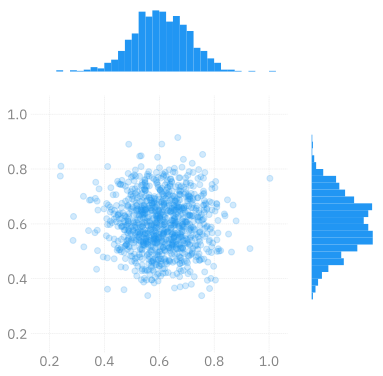
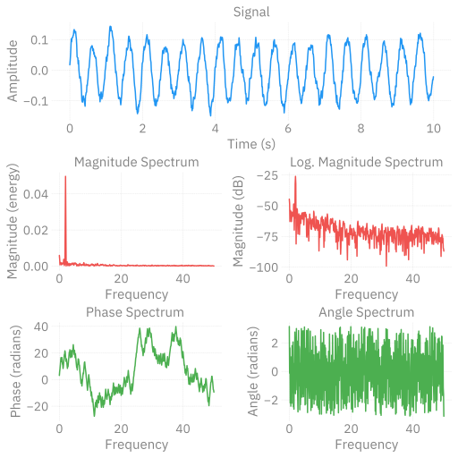
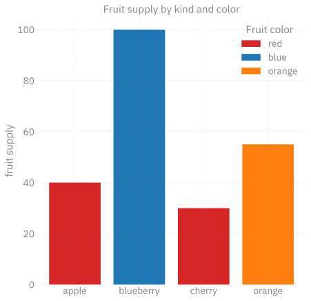
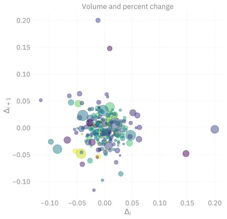
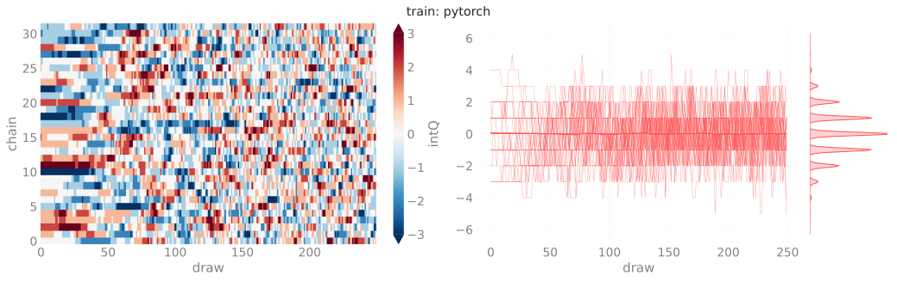
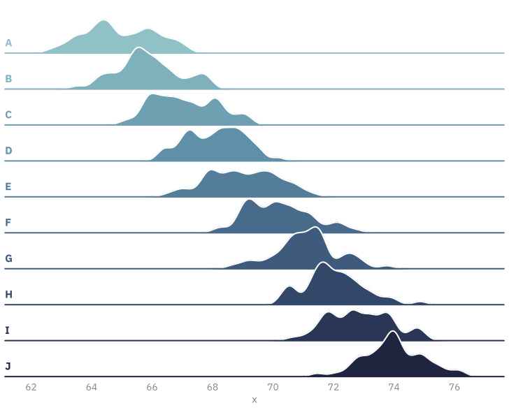

# `ambivalent`
Sam Foreman
2023-12-28

- [Examples](#examplesexamples)
- [More Examples](#more-examples)
  - [InferenceData](#inferencedata)
  - [Ridgeplot](#ridgeplot)
- [Execution](#execution)
  - [2D Density](#d-density)

[~~`opinionated`~~](https://github.com/saforem2/opinionated)
$\longrightarrow$
[**`ambivalent`**](https://github.com/saforem2/ambivalent)

Clean, simple style for Matplotlib figures.

Transparent backgrounds with grey text <a href='#'></a>
that are `{light, dark}`-mode independent.

## Examples[^1]

<div layout-valign="bottom"
style="display: flex; text-align:center; align-items: flex-end;">

<table>
<colgroup>
<col style="width: 50%" />
<col style="width: 50%" />
</colgroup>
<tbody>
<tr class="odd">
<td style="text-align: center;"><div width="50.0%"
data-layout-align="center">
<p></p>
</div></td>
<td style="text-align: center;"><div width="50.0%"
data-layout-align="center">
<p></p>
</div></td>
</tr>
</tbody>
</table>

</div>

<div layout-valign="bottom"
style="display: flex; text-align:center; align-items: flex-end;">

<table>
<colgroup>
<col style="width: 50%" />
<col style="width: 50%" />
</colgroup>
<tbody>
<tr class="odd">
<td style="text-align: center;"><div width="50.0%"
data-layout-align="center">
<p></p>
</div></td>
<td style="text-align: center;"><div width="50.0%"
data-layout-align="center">
<p></p>
</div></td>
</tr>
</tbody>
</table>

</div>

## More Examples

### InferenceData

<div id="fig-chains" style="display: flex; text-align:center;">



Figure 5: Figure from [`l2hmc-qcd`
Notebook](https://saforem2.github.io/l2hmc-qcd/qmd/l2hmc-2dU1/l2hmc-2dU1.html)

</div>

### Ridgeplot

<div id="fig-ridgeplot" style="display: flex; text-align:center;">



Figure 6: Figure from [Seaborn
Example](https://seaborn.pydata.org/examples/kde_ridgeplot)

</div>

------------------------------------------------------------------------

## Execution

``` python
import warnings
from ambivalent import STYLES
import matplotlib.pyplot as plt
import numpy as np

warnings.filterwarnings("ignore")

# Fixing random state for reproducibility
np.random.seed(19680801)
plt.style.use(STYLES['ambivalent'])

# some random data
x = np.random.randn(1000)
y = np.random.randn(1000)


def scatter_hist(x, y, ax, ax_histx, ax_histy, alpha: float = 0.4):
    # no labels
    ax_histx.tick_params(axis="x", labelbottom=False)
    ax_histy.tick_params(axis="y", labelleft=False)

    # the scatter plot:
    ax.scatter(x, y, alpha=alpha)

    # now determine nice limits by hand:
    binwidth = 0.25
    xymax = max(np.max(np.abs(x)), np.max(np.abs(y)))
    lim = (int(xymax/binwidth) + 1) * binwidth

    bins = np.arange(-lim, lim + binwidth, binwidth)
    ax_histx.hist(x, bins=bins)
    ax_histy.hist(y, bins=bins, orientation='horizontal')
```

### 2D Density

<details>
<summary>Make the plot</summary>

``` python
# Start with a square Figure.
fig = plt.figure(figsize=(6, 6))
# Add a gridspec with two rows and two columns and a ratio of 1 to 4 between
# the size of the marginal axes and the main axes in both directions.
# Also adjust the subplot parameters for a square plot.
gs = fig.add_gridspec(2, 2,  width_ratios=(4, 1), height_ratios=(1, 4),
                      left=0.1, right=0.9, bottom=0.1, top=0.9,
                      wspace=0.15, hspace=0.15)
# Create the Axes.
ax = fig.add_subplot(gs[1, 0])
ax_histx = fig.add_subplot(gs[0, 0], sharex=ax)
ax_histy = fig.add_subplot(gs[1, 1], sharey=ax)
_ = fig.axes[1].grid(False)
_ = fig.axes[2].set_xticklabels([])
_ = fig.axes[1].set_yticklabels([])
_ = fig.axes[2].grid(False)
_ = fig.axes[0].set_xticklabels(fig.axes[0].get_xticklabels())
_ = fig.axes[0].set_yticklabels(fig.axes[0].get_yticklabels())

# Draw the scatter plot and marginals.
_ = scatter_hist(x, y, ax, ax_histx, ax_histy)
_ = plt.show()
```

</details>


---

<div>

> **<span style="color: #FF5252;"> Status</span>**
>
> <pre style="white-space:pre;overflow-x:auto;line-height:normal;font-family:Menlo,'DejaVu Sans Mono',consolas,'Courier New',monospace"><span style="color: #7f7f7f; text-decoration-color: #7f7f7f; font-style: italic">Last Updated</span>: <span style="color: #f06292; text-decoration-color: #f06292; font-weight: bold">12</span><span style="color: #f06292; text-decoration-color: #f06292">/</span><span style="color: #f06292; text-decoration-color: #f06292; font-weight: bold">28</span><span style="color: #f06292; text-decoration-color: #f06292">/</span><span style="color: #f06292; text-decoration-color: #f06292; font-weight: bold">2023</span> <span style="color: #7f7f7f; text-decoration-color: #7f7f7f">@</span> <span style="color: #1a8fff; text-decoration-color: #1a8fff; font-weight: bold">19:05:35</span>
> </pre>
>
> <span style="text-align:center;"></span>

</div>

[^1]: Examples from [Matplotlib
    Examples](https://matplotlib.org/stable/gallery/index.html)
