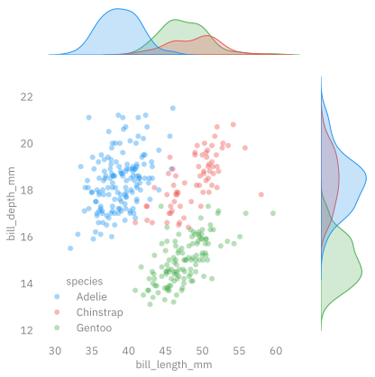
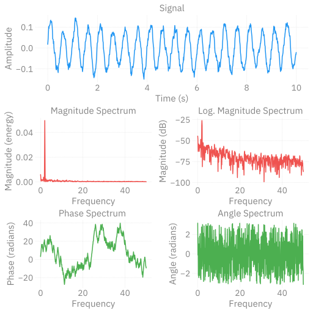
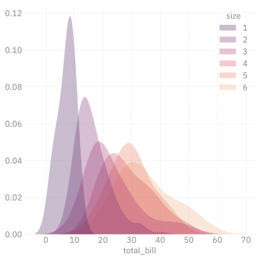
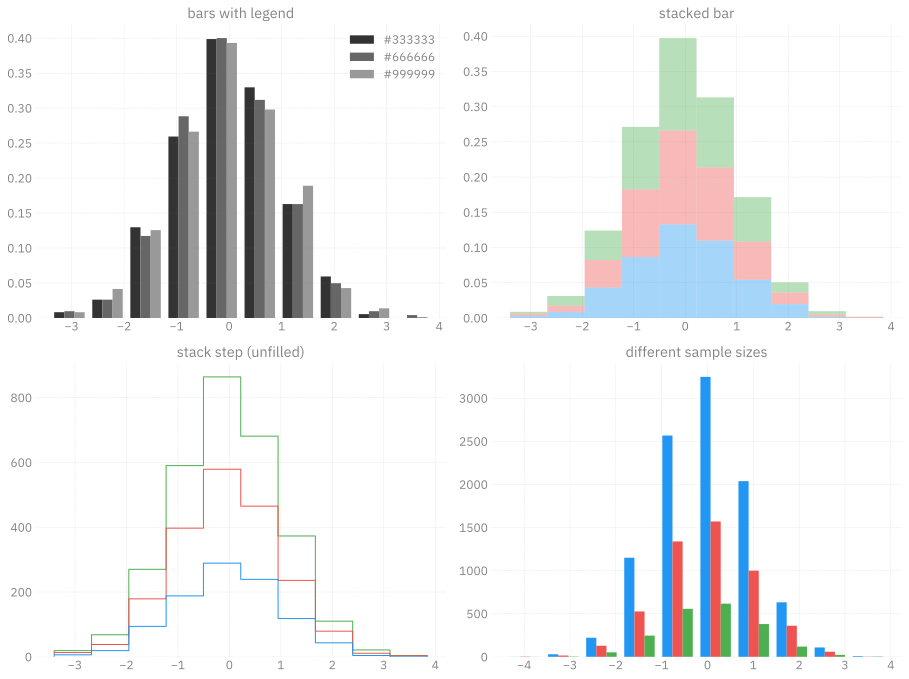
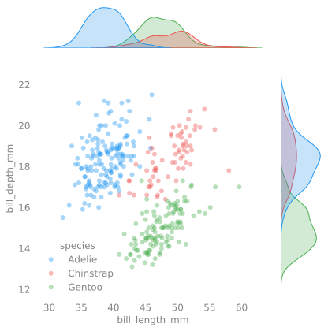
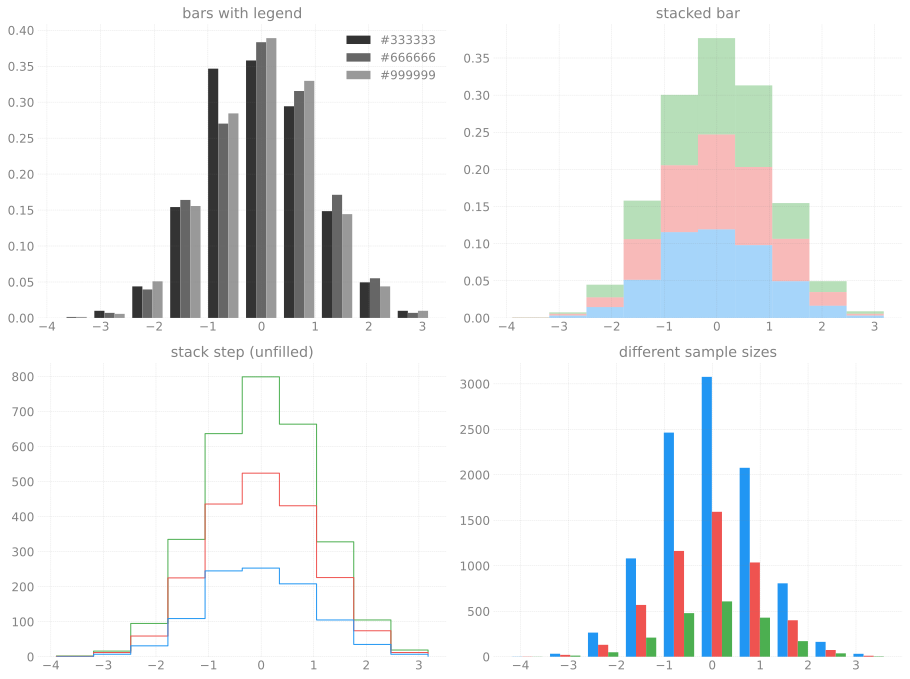

# `ambivalent` 🤷🏻‍♂️
Sam Foreman
2023-12-29

[~~`opinionated`~~](https://github.com/saforem2/opinionated)
$\longrightarrow$
[**`ambivalent`**](https://github.com/saforem2/ambivalent)

Clean, simple style for Matplotlib figures.

Transparent backgrounds with grey text
$\textcolor{#838383}{\blacksquare}$ that are accessible / legible and
`{light, dark}`-mode independent.

## Examples[^1]

<div class="flex" style="flex-direction:row;">

<div layout-valign="bottom"
style="display: flex; text-align:center; align-items: flex-end;">

<table>
<colgroup>
<col style="width: 50%" />
<col style="width: 50%" />
</colgroup>
<tbody>
<tr class="odd">
<td style="text-align: center;"><div width="50.0%"
data-layout-align="center">
<p></p>
</div></td>
<td style="text-align: center;"><div width="50.0%"
data-layout-align="center">
<p></p>
</div></td>
</tr>
</tbody>
</table>

</div>

<div layout-valign="bottom"
style="display: flex; text-align:center; align-items: flex-end;">

<table>
<colgroup>
<col style="width: 50%" />
<col style="width: 50%" />
</colgroup>
<tbody>
<tr class="odd">
<td style="text-align: center;"><div width="50.0%"
data-layout-align="center">
<p></p>
</div></td>
<td style="text-align: center;"><div width="50.0%"
data-layout-align="center">
<p></p>
</div></td>
</tr>
</tbody>
</table>

</div>

<div style="display: flex; text-align:center;">

<table>
<colgroup>
<col style="width: 100%" />
</colgroup>
<tbody>
<tr class="odd">
<td style="text-align: center;"><div width="100.0%"
data-layout-align="center">
<p></p>
</div></td>
</tr>
</tbody>
</table>

</div>

</div>

## More Examples

<div layout-valign="bottom" style="display: flex; text-align:center;">

<table style="width:100%;">
<colgroup>
<col style="width: 33%" />
<col style="width: 33%" />
<col style="width: 33%" />
</colgroup>
<tbody>
<tr class="odd">
<td style="text-align: center;"><div width="33.3%"
data-layout-align="center">
<p></p>
</div></td>
<td style="text-align: center;"><div width="33.3%"
data-layout-align="center">
<p></p>
</div></td>
<td style="text-align: center;"><div width="33.3%"
data-layout-align="center">
<p></p>
</div></td>
</tr>
</tbody>
</table>

</div>

<details closed>
<summary>
<italic>Even more…</italic>
</summary>

<div id="fig-chains-dQ" layout-valign="bottom"
style="display: flex; text-align:center;">

<table>
<colgroup>
<col style="width: 100%" />
</colgroup>
<tbody>
<tr class="odd">
<td style="text-align: center;"><div width="100.0%"
data-layout-align="center">
<p></p>
</div></td>
</tr>
</tbody>
</table>

Figure 9: Figure from [`l2hmc-qcd`
Notebook](https://saforem2.github.io/l2hmc-qcd/qmd/l2hmc-2dU1/l2hmc-2dU1.html#inference)

</div>

### InferenceData

<div id="fig-xeps" style="display: flex; text-align:center;">


Figure 10: $\varepsilon_{x}$ during training

</div>

<div id="fig-veps" style="display: flex; text-align:center;">


Figure 11: $\varepsilon_{x}$ during training

</div>

<div id="fig-combined-chains" style="display: flex; text-align:center;">

<table>
<colgroup>
<col style="width: 100%" />
</colgroup>
<tbody>
<tr class="odd">
<td style="text-align: center;"><div width="100.0%"
data-layout-align="center">
<p></p>
</div></td>
</tr>
</tbody>
</table>

Figure 12: Figure from [`l2hmc-qcd`
Notebook](https://saforem2.github.io/l2hmc-qcd/qmd/l2hmc-2dU1/l2hmc-2dU1.html)

</div>

</details>

## Getting Started

- Use `ambivalend.STYLES['ambivalent']` as the default style for
  `matplotlib`.

``` python
import matplotlib.pyplot as plt
from ambivalent import STYLES
plt.style.use(STYLES['ambivalent'])
```

## `seaborn` Tips Dataset

- [Tips Dataset
  Example](https://seaborn.pydata.org/generated/seaborn.kdeplot.html)
- [Seaborn Gallery](https://seaborn.pydata.org/examples/index.html)

<details>
<summary>View Code</summary>

``` python
import seaborn as sns

tips = sns.load_dataset("tips")
tips.head()

fig, ax = plt.subplots(figsize=(6, 6))  # , ncols=2)

_ = sns.kdeplot(
   data=tips, x="total_bill", hue="size",
   fill=True, common_norm=False, palette="flare_r",
   alpha=.3, linewidth=0,
   ax=ax,  # [0],
)
_ = ax.set_ylabel('')
# _ = sns.kdeplot(
#    data=tips, x="tip", hue="size",
#    fill=True, common_norm=False, palette="crest",
#    alpha=.3, linewidth=0,
#    ax=ax[1],
# )
```

</details>


## `seaborn` Scatter Plot

<details>
<summary>View Code</summary>

``` python
import seaborn as sns
import matplotlib.pyplot as plt

# Load the example diamonds dataset
diamonds = sns.load_dataset("diamonds")

# Draw a scatter plot while assigning point colors and sizes to different
# variables in the dataset
f, ax = plt.subplots(figsize=(6, 6))
_ = sns.despine(f, left=True, bottom=True)
_ = clarity_ranking = ["I1", "SI2", "SI1", "VS2", "VS1", "VVS2", "VVS1", "IF"]
_ = sns.scatterplot(x="carat", y="price",
                hue="clarity", size="depth",
                palette="flare",
                hue_order=clarity_ranking,
                sizes=(1, 8), linewidth=0,
                data=diamonds, ax=ax)
```

</details>


## Histogram + Scatter Plot

<details>
<summary>View Code</summary>

``` python
import numpy as np
import seaborn as sns
import matplotlib.pyplot as plt

# Simulate data from a bivariate Gaussian
n = 10000
mean = [0, 0]
cov = [(2, .4), (.4, .2)]
rng = np.random.RandomState(0)
x, y = rng.multivariate_normal(mean, cov, n).T

# Draw a combo histogram and scatterplot with density contours
f, ax = plt.subplots(figsize=(6, 6))
_ = sns.scatterplot(x=x, y=y, s=5, color="#666666", alpha=0.3)
_ = sns.histplot(x=x, y=y, bins=50, pthresh=.1, cmap="flare_r")
_ = sns.kdeplot(x=x, y=y, levels=5, color="w", linewidths=1)
_ = ax.set_xlabel('x')
_ = ax.set_ylabel('y')
_ = plt.show()
```

</details>


## Jointplot

<details>
<summary>View Code</summary>

``` python
import seaborn as sns
# Load the penguins dataset
penguins = sns.load_dataset("penguins")
# Show the joint distribution using kernel density estimation
import matplotlib as mpl
with mpl.rc_context(plt.rcParams.update({'axes.grid': False})):
  g = sns.jointplot(
      data=penguins,
      x="bill_length_mm",
      y="bill_depth_mm",
      hue="species",
      # kind="kde",
      edgecolors='none',
      alpha=0.4,
  )
  _ = plt.grid(False)
  plt.show()
```

</details>



## Matplotlib Histograms

<details>
<summary>View Code</summary>

``` python
import matplotlib.pyplot as plt
import numpy as np

n_bins = 10
x = np.random.randn(1000, 3)

plt.rcParams['axes.grid'] = True

fig, ((ax0, ax1), (ax2, ax3)) = plt.subplots(nrows=2, ncols=2)

colors = ['#333333', '#666666', '#999999']
ax0.hist(x, n_bins, density=True, histtype='bar', color=colors, label=colors)
_ = ax0.legend()
_ = ax0.set_title('bars with legend')

_ = ax1.hist(x, n_bins, density=True, histtype='bar', stacked=True, alpha=0.4)
_ = ax1.set_title('stacked bar')

_ = ax2.hist(x, n_bins, histtype='step', stacked=True, fill=False)
_ = ax2.set_title('stack step (unfilled)')

# Make a multiple-histogram of data-sets with different length.
x_multi = [np.random.randn(n) for n in [10000, 5000, 2000]]
_ = ax3.hist(x_multi, n_bins, histtype='bar')
_ = ax3.set_title('different sample sizes')

_ = fig.tight_layout()
plt.show()
```

</details>



<!-- ```{python} -->
<!-- #| code-fold: true -->
<!-- #| code-summary: "boxenplot" -->
<!-- #| label: fig-py-boxenplot -->
<!-- #| output: true -->
<!-- #| fig-cap: "Seaborn Boxenplot" -->
<!-- #| layout: [[100]] -->
<!---->
<!-- import seaborn as sns -->
<!---->
<!-- diamonds = sns.load_dataset("diamonds") -->
<!-- clarity_ranking = ["I1", "SI2", "SI1", "VS2", "VS1", "VVS2", "VVS1", "IF"] -->
<!---->
<!-- sns.boxenplot( -->
<!--     diamonds, x="clarity", y="carat", -->
<!--     color="b", order=clarity_ranking, width_method="linear", -->
<!-- ) -->
<!-- ``` -->
<!-- ```{python} -->
<!-- import warnings -->
<!-- from ambivalent import STYLES -->
<!-- import matplotlib.pyplot as plt -->
<!-- import numpy as np -->
<!---->
<!-- plt.style.use(STYLES['ambivalent']) -->
<!---->
<!-- # some random data -->
<!-- x = np.random.randn(1000) -->
<!-- y = np.random.randn(1000) -->
<!---->
<!---->
<!-- def scatter_hist(x, y, ax, ax_histx, ax_histy, alpha: float = 0.4): -->
<!--     # no labels -->
<!--     ax_histx.tick_params(axis="x", labelbottom=False) -->
<!--     ax_histy.tick_params(axis="y", labelleft=False) -->
<!---->
<!--     # the scatter plot: -->
<!--     ax.scatter(x, y, alpha=alpha) -->
<!---->
<!--     # now determine nice limits by hand: -->
<!--     binwidth = 0.25 -->
<!--     xymax = max(np.max(np.abs(x)), np.max(np.abs(y))) -->
<!--     lim = (int(xymax/binwidth) + 1) * binwidth -->
<!---->
<!--     bins = np.arange(-lim, lim + binwidth, binwidth) -->
<!--     ax_histx.hist(x, bins=bins) -->
<!--     ax_histy.hist(y, bins=bins, orientation='horizontal') -->
<!-- ``` -->
<!-- ### 2D Density -->
<!---->
<!-- ```{python} -->
<!-- #| code-fold: true -->
<!-- #| code-summary: "Make the plot" -->
<!-- #| label: fig-py-density2d -->
<!-- #| output: true -->
<!-- #| fig-cap: "2D Density plot" -->
<!-- #| layout: [[100]] -->
<!---->
<!-- # Start with a square Figure. -->
<!-- fig = plt.figure(figsize=(6, 6)) -->
<!-- # Add a gridspec with two rows and two columns and a ratio of 1 to 4 between -->
<!-- # the size of the marginal axes and the main axes in both directions. -->
<!-- # Also adjust the subplot parameters for a square plot. -->
<!-- gs = fig.add_gridspec(2, 2,  width_ratios=(4, 1), height_ratios=(1, 4), -->
<!--                       left=0.1, right=0.9, bottom=0.1, top=0.9, -->
<!--                       wspace=0.15, hspace=0.15) -->
<!-- # Create the Axes. -->
<!-- ax = fig.add_subplot(gs[1, 0]) -->
<!-- ax_histx = fig.add_subplot(gs[0, 0], sharex=ax) -->
<!-- ax_histy = fig.add_subplot(gs[1, 1], sharey=ax) -->
<!-- _ = fig.axes[1].grid(False) -->
<!-- _ = fig.axes[2].set_xticklabels([]) -->
<!-- _ = fig.axes[1].set_yticklabels([]) -->
<!-- _ = fig.axes[2].grid(False) -->
<!-- _ = fig.axes[0].set_xticklabels(fig.axes[0].get_xticklabels()) -->
<!-- _ = fig.axes[0].set_yticklabels(fig.axes[0].get_yticklabels()) -->
<!---->
<!-- # Draw the scatter plot and marginals. -->
<!-- _ = scatter_hist(x, y, ax, ax_histx, ax_histy) -->
<!-- _ = plt.show() -->
<!-- ``` -->
<!---->
<!---->
<!-- ```{python} -->
<!-- import numpy as np -->
<!-- import matplotlib.animation as animation -->
<!---->
<!-- # Fixing random state for reproducibility -->
<!-- np.random.seed(19680801) -->
<!---->
<!---->
<!-- def random_walk(num_steps, max_step=0.05): -->
<!--     """Return a 3D random walk as (num_steps, 3) array.""" -->
<!--     start_pos = np.random.random(3) -->
<!--     steps = np.random.uniform(-max_step, max_step, size=(num_steps, 3)) -->
<!--     walk = start_pos + np.cumsum(steps, axis=0) -->
<!--     return walk -->
<!---->
<!---->
<!-- def update_lines(num, walks, lines): -->
<!--     for line, walk in zip(lines, walks): -->
<!--         # NOTE: there is no .set_data() for 3 dim data... -->
<!--         line.set_data(walk[:num, :2].T) -->
<!--         line.set_3d_properties(walk[:num, 2]) -->
<!--     return lines -->
<!---->
<!---->
<!-- # Data: 40 random walks as (num_steps, 3) arrays -->
<!-- num_steps = 30 -->
<!-- walks = [random_walk(num_steps) for index in range(40)] -->
<!---->
<!-- # Attaching 3D axis to the figure -->
<!-- fig = plt.figure() -->
<!-- ax = fig.add_subplot(projection="3d") -->
<!---->
<!-- # Create lines initially without data -->
<!-- lines = [ax.plot([], [], [])[0] for _ in walks] -->
<!---->
<!-- # Setting the axes properties -->
<!-- _ = ax.set(xlim3d=(0, 1), xlabel='X') -->
<!-- _ = ax.set(ylim3d=(0, 1), ylabel='Y') -->
<!-- _ = ax.set(zlim3d=(0, 1), zlabel='Z') -->
<!---->
<!-- # Creating the Animation object -->
<!-- ani = animation.FuncAnimation( -->
<!--     fig, update_lines, num_steps, fargs=(walks, lines), interval=100) -->
<!---->
<!-- plt.show() -->
<!-- ``` -->

<div>

> **<span style="color: #FF5252;"> Status</span>**
>
> <span style="text-align:center;"></span>
>
> <pre style="white-space:pre;overflow-x:auto;line-height:normal;font-family:Menlo,'DejaVu Sans Mono',consolas,'Courier New',monospace"><span style="color: #7f7f7f; text-decoration-color: #7f7f7f; font-style: italic">Last Updated</span>: <span style="color: #f06292; text-decoration-color: #f06292; font-weight: bold">12</span><span style="color: #f06292; text-decoration-color: #f06292">/</span><span style="color: #f06292; text-decoration-color: #f06292; font-weight: bold">29</span><span style="color: #f06292; text-decoration-color: #f06292">/</span><span style="color: #f06292; text-decoration-color: #f06292; font-weight: bold">2023</span> <span style="color: #7f7f7f; text-decoration-color: #7f7f7f">@</span> <span style="color: #1a8fff; text-decoration-color: #1a8fff; font-weight: bold">10:42:06</span>
> </pre>

</div>

[^1]: Examples from [Matplotlib
    Examples](https://matplotlib.org/stable/gallery/index.html)
